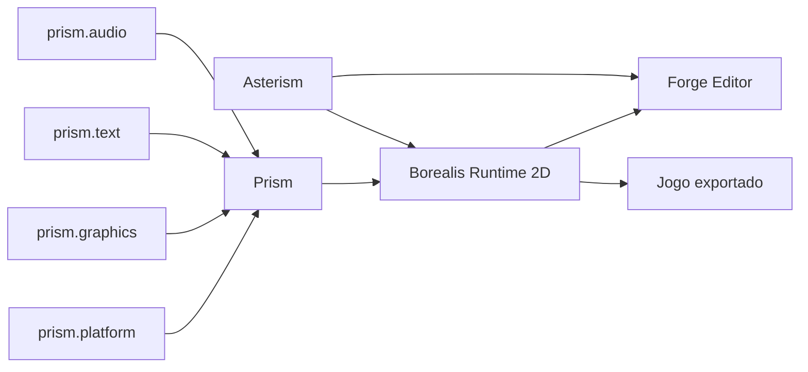
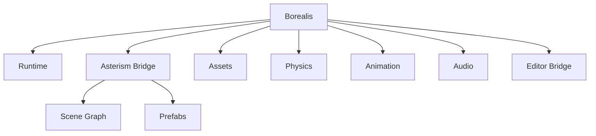
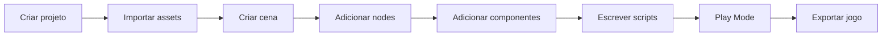

# Plano de Implementacao da Engine 2D Borealis (TDAH-Friendly)

- Status: proposta de implementacao
- Data: 2026-04-20
- Escopo: engine 2D oficial do ecossistema Zenith
- Engine: `Borealis`
- Base nativa: `Prism`
- Cena e hierarquia: `Asterism`
- Editor visual: `Forge`

## Objetivo

Este documento explica como construir a engine 2D da Zenith.

A ideia e misturar:

1. a simplicidade do GameMaker
2. a organizacao da Unity
3. a clareza da filosofia Zenith

Frase guia:

`Borealis deve ser rapida para comecar, clara para aprender e estruturada para crescer.`

---

## Leitura rapida

Se voce lembrar de apenas 8 coisas:

1. `Prism` cuida de janela, input, render, texto e audio.
2. `Asterism` cuida de cenas, nodes, hierarquia e prefabs.
3. `Borealis` cuida do jogo 2D: runtime, fisica, assets, scripts e sistemas.
4. `Forge` cuida do editor visual.
5. A experiencia deve parecer simples como GameMaker.
6. A organizacao deve escalar como Unity.
7. A API deve ser reading-first, sem magia escondida.
8. A v1 deve focar em jogos 2D reais, nao em uma engine universal.

---

## 1. Visao geral



Como ler:

1. `Prism` e a fundacao tecnica.
2. `Asterism` e a camada de cena, nodes, hierarquia e prefabs.
3. `Borealis` usa `Prism` e `Asterism` para criar o runtime de jogo.
4. `Forge` usa `Borealis` e `Asterism` para editar cenas e assets.
5. O jogo exportado usa o runtime, mas nao precisa carregar o editor.

---

## 2. Filosofia da engine

### 2.1 Simples por fora

O usuario deve conseguir criar um jogo pequeno sem entender arquitetura profunda.

Exemplo mental:

```zt
node "Player"
    sprite "player_idle"
    script PlayerController
end
```

### 2.2 Estruturada por dentro

Por baixo, a engine precisa ser organizada.

Sem isso, projetos medios viram bagunca.

### 2.3 Explicita

Comportamentos importantes devem aparecer no codigo ou no editor.

Exemplos:

1. se um objeto tem fisica, isso deve ser visivel
2. se uma cena carrega outra, isso deve ser claro
3. se um script roda por frame, isso deve ser declarado

### 2.4 Amigavel para TDAH/dislexia

A engine deve reduzir ruido.

Decisoes recomendadas:

1. nomes claros
2. menos simbolos desnecessarios
3. paineis previsiveis
4. mensagens de erro com acao recomendada
5. exemplos curtos e visuais

---

## 3. O que copiar do GameMaker

Copiar aqui significa usar como inspiracao, nao clonar.

Coisas boas:

1. criar objetos rapidamente
2. colocar objetos na cena com pouco atrito
3. eventos simples como `on_create`, `on_update`, `on_collision`
4. sprite animation facil
5. rooms/scenes simples de entender
6. fluxo rapido: criar, rodar, ajustar

O que nao copiar:

1. excesso de estado global
2. scripts soltos sem organizacao
3. magia demais em eventos
4. estrutura que fica confusa em projeto grande

---

## 4. O que copiar da Unity

Coisas boas:

1. `Scene`
2. `GameObject` ou `Node`
3. componentes
4. prefabs
5. inspector
6. asset browser
7. play mode
8. hierarchy
9. editor extensivel

O que nao copiar:

1. complexidade excessiva
2. configuracao demais para caso simples
3. menus profundos demais
4. APIs com comportamento implicito dificil de rastrear

---

## 5. Decisao central: Node + Component

A API publica deve usar:

1. `Scene`
2. `Node`
3. `Component`
4. `Script`

Essa camada pertence principalmente ao `Asterism`.

A `Borealis` adiciona comportamento de jogo 2D em cima dela.

Isso e mais facil de explicar que ECS puro.

### O que e Node

`Node` e um objeto dentro da cena.

Exemplos:

1. jogador
2. inimigo
3. camera
4. porta
5. luz 2D
6. tilemap

### O que e Component

`Component` e uma peca que adiciona comportamento ou dados ao `Node`.

Exemplos:

1. `SpriteRenderer`
2. `RigidBody2D`
3. `Collider2D`
4. `AudioSource`
5. `Camera2D`
6. `Script`

### Por que isso e bom

Porque fica facil pensar assim:

`um Node e uma coisa; componentes dizem o que essa coisa tem ou faz.`

---

## 6. ECS interno: sim, mas escondido

ECS significa:

- Entity
- Component
- System

ECS e bom para performance.

Mas ECS puro pode ser dificil para iniciantes.

Recomendacao:

1. usar `Node + Component` para o usuario
2. usar ECS interno depois, se necessario
3. nao forcar o usuario a pensar em ECS na v1

Se usar uma lib:

1. `Flecs` pode ser avaliado para runtime interno
2. tambem e possivel criar um ECS simples proprio no comeco

Decisao pragmatica:

Na v1, comece simples.

Se a performance pedir, otimize por baixo sem quebrar a API publica.

---

## 7. Camadas da Borealis e Asterism



Como ler:

1. `Asterism` nao e detalhe secundario.
2. `Asterism` e a base de cena/nos/prefabs.
3. `Borealis` usa essa base e adiciona sistemas de jogo 2D.

## 8. borealis.runtime

### Responsabilidade

Controlar o ciclo principal do jogo.

### O que faz

1. inicia o jogo
2. carrega cena inicial
3. roda update por frame
4. chama render
5. controla tempo
6. pausa e retoma
7. encerra com cleanup correto

### Conceitos importantes

1. `Game`
2. `GameLoop`
3. `Time`
4. `DeltaTime`
5. `FixedUpdate`

### Por que existe

Sem runtime, a engine nao tem ritmo.

O runtime e o relogio do jogo.

---

## 9. asterism.scene

### Responsabilidade

Organizar tudo que existe em uma fase/tela.

Esta camada pertence ao `Asterism`.

A `Borealis` nao deve reinventar uma segunda arvore de cena.

### O que faz

1. cria cenas
2. carrega cenas
3. descarrega cenas
4. gerencia nodes
5. salva estrutura da cena
6. instancia prefabs

### Conceitos importantes

1. `Scene`
2. `Node`
3. `Transform2D`
4. `Prefab`
5. `Hierarchy`

### Por que existe

Sem cena, tudo vira objeto solto.

A cena da contexto para o jogo.

### Onde a Borealis entra

A `Borealis` usa a cena do `Asterism` para:

1. anexar componentes de jogo
2. rodar scripts
3. sincronizar fisica
4. renderizar sprites e tilemaps
5. salvar e carregar cenas do projeto

---

## 10. borealis.render2d

### Responsabilidade

Desenhar o mundo 2D.

### O que faz

1. sprites
2. sprite sheets
3. tilemaps
4. camera 2D
5. layers
6. sorting
7. batching
8. render targets
9. debug draw

### Usa da Prism

1. `prism.graphics`
2. `prism.text`
3. `prism.platform`

### Componentes basicos

1. `SpriteRenderer`
2. `TilemapRenderer`
3. `Camera2D`
4. `TextRenderer`
5. `DebugDraw2D`

---

## 11. borealis.animation

### Responsabilidade

Controlar animacoes 2D.

### O que faz

1. animacao por spritesheet
2. troca de frames
3. estados de animacao
4. eventos em frames
5. blend simples
6. preview no editor

### Conceitos importantes

1. `AnimationClip`
2. `Animator2D`
3. `AnimationState`
4. `FrameEvent`

### Formatos de apoio

1. Aseprite exportado como spritesheet + JSON
2. spritesheet manual

---

## 12. borealis.physics2d

### Responsabilidade

Colisao e fisica 2D.

### O que faz

1. corpos fisicos
2. colisores
3. sensores
4. raycast
5. contatos
6. eventos de colisao
7. debug draw

### Lib recomendada

`Box2D`

### Por que usar Box2D

Fisica e dificil de fazer bem.

Usar Box2D reduz muito o risco.

### Componentes basicos

1. `RigidBody2D`
2. `BoxCollider2D`
3. `CircleCollider2D`
4. `CapsuleCollider2D`
5. `PhysicsMaterial2D`

---

## 13. borealis.audio2d

### Responsabilidade

Som de jogo.

### O que faz

1. tocar efeitos
2. tocar musica
3. controlar volume
4. pausar audio
5. audio por cena
6. audio posicional 2D simples

### Usa da Prism

1. `prism.audio`

### Componentes basicos

1. `AudioSource`
2. `AudioListener2D`
3. `MusicPlayer`

---

## 14. borealis.assets

### Responsabilidade

Importar, converter, cachear e carregar assets.

### O que faz

1. importa imagens
2. importa audio
3. importa spritesheets
4. importa tilemaps
5. gera metadados
6. cria cache de build
7. detecta assets quebrados
8. mostra erros claros no editor

### Conceitos importantes

1. `AssetId`
2. `AssetMeta`
3. `Importer`
4. `AssetCache`
5. `AssetDatabase`

### Formatos recomendados na v1

1. PNG
2. WAV
3. OGG
4. JSON
5. Aseprite exportado
6. Tiled JSON ou LDtk JSON

---

## 15. borealis.input

### Responsabilidade

Transformar teclado, mouse e gamepad em acoes de jogo.

### O que faz

1. ler teclado
2. ler mouse
3. ler gamepad
4. mapear acoes
5. suportar rebinding
6. separar input bruto de input semantico

### Exemplo

Input bruto:

```text
tecla A pressionada
```

Input semantico:

```text
move_left acionado
```

### Por que isso importa

Se o jogo usa `move_left`, ele nao precisa saber se veio do teclado, controle ou outro dispositivo.

---

## 16. borealis.scripting

### Responsabilidade

Permitir comportamento de jogo em Zenith.

### O que faz

1. scripts por node
2. callbacks claros
3. acesso seguro a componentes
4. hot reload no editor, quando viavel
5. mensagens de erro boas

### Callbacks iniciais

1. `on_create`
2. `on_update`
3. `on_fixed_update`
4. `on_destroy`
5. `on_collision_enter`
6. `on_collision_exit`

### Regra de filosofia

Poucos callbacks na v1.

Muitos callbacks deixam a engine confusa.

---

## 17. Forge Editor

`Forge` e o editor visual.

Ele nao deve morar dentro do runtime final do jogo.

### Paineis principais

1. `Scene View`
2. `Game View`
3. `Hierarchy`
4. `Inspector`
5. `Assets`
6. `Console`
7. `Profiler`
8. `Animation`

### Base recomendada para v1

Usar Dear ImGui `docking branch`.

### Por que usar docking branch

Ela entrega:

1. paineis encaixaveis
2. layout tipo Unity/Godot
3. janelas destacaveis
4. multi-monitor
5. velocidade de implementacao

### Decisao visual

Dear ImGui nao deve definir a identidade visual final.

Criar uma camada:

```text
Forge UI Kit
```

Ela deve conter:

1. tema visual
2. componentes padrao
3. modals
4. toolbars
5. inspector
6. asset grid
7. estilos acessiveis

---

## 18. Fluxo ideal para o usuario



O fluxo precisa ser previsivel.

O usuario nao deve lutar contra a ferramenta.

---

## 19. Exemplo de jogo minimo

Exemplo conceitual:

```zt
use borealis

scene "LevelOne"
    node "Camera"
        camera2d
    end

    node "Player"
        transform x = 100, y = 120
        sprite "player_idle"
        body dynamic
        collider box width = 16, height = 24
        script PlayerController
    end
end
```

Esse exemplo mostra a direcao desejada:

1. estrutura visual
2. baixo ruido
3. leitura vertical
4. comportamento explicito

---

## 20. Bibliotecas de apoio recomendadas

### Janela, eventos e input

`SDL3`

Usar para:

1. janela
2. eventos
3. mouse
4. teclado
5. gamepad
6. clipboard
7. base multiplataforma

### GPU e render base

Opcoes:

1. SDL3 GPU
2. Skia, se o foco for 2D vetorial/texto rico

### Audio

Opcoes:

1. `miniaudio`
2. SDL3 Audio

Recomendacao:

`miniaudio` para audio dedicado.

SDL3 Audio se quiser reduzir dependencias no comeco.

### Fisica

`Box2D`

### UI do editor

Dear ImGui `docking branch`

### ECS interno opcional

`Flecs`

Usar apenas se a v1 realmente precisar.

### Mapas

1. Tiled JSON
2. LDtk JSON

### Sprites

1. Aseprite spritesheet + JSON
2. PNG simples

---

## 21. Dificuldade com e sem libs

Escala:

- 1 = facil
- 3 = medio
- 5 = muito dificil

### Sem libs

Dificuldade geral: `5/5`

Motivos:

1. criar render proprio e caro
2. fisica propria e arriscada
3. audio proprio e complexo
4. editor visual e muito trabalho
5. importacao de assets exige muitos detalhes

### Com libs recomendadas

Dificuldade geral: `3/5 a 4/5`

Motivos:

1. libs reduzem risco tecnico
2. ainda sobra muita integracao
3. ainda precisa desenhar API Zenith
4. ainda precisa criar editor e workflow

### Onde fica mais dificil

1. editor visual
2. asset pipeline
3. play mode com hot reload
4. serializacao de cenas/prefabs
5. debugging e mensagens claras

---

## 22. Roadmap de implementacao

## Fase 0: Prototipo tecnico

Objetivo:

Provar que a base roda.

Entregas:

1. janela
2. loop
3. input
4. render de sprite
5. camera 2D simples
6. audio basico

Gate:

Um sprite controlavel aparece na tela com som basico.

---

## Fase 1: Runtime jogavel

Objetivo:

Criar um jogo pequeno sem editor.

Entregas:

1. `Game`
2. `Scene`
3. `Node`
4. `Component`
5. `Transform2D`
6. `SpriteRenderer`
7. `Camera2D`
8. input actions
9. scripts Zenith

Gate:

Criar um mini jogo via codigo.

---

## Fase 2: Fisica e tilemap

Objetivo:

Permitir plataforma/top-down basico.

Entregas:

1. Box2D integrado
2. colisores
3. rigid bodies
4. eventos de colisao
5. tilemap
6. Tiled ou LDtk importer

Gate:

Criar fase com colisao, chao, paredes e player.

---

## Fase 3: Asset pipeline

Objetivo:

Organizar assets como produto real.

Entregas:

1. `AssetDatabase`
2. importers
3. metadata
4. cache
5. ids estaveis
6. erro claro para asset quebrado

Gate:

Renomear/mover asset nao quebra a cena sem diagnostico claro.

---

## Fase 4: Forge editor v1

Objetivo:

Editar jogo visualmente.

Entregas:

1. docking layout
2. scene view
3. hierarchy
4. inspector
5. asset browser
6. console
7. play mode
8. save/load scene

Gate:

Criar uma cena jogavel sem editar tudo manualmente.

---

## Fase 5: Prefabs e workflow serio

Objetivo:

Dar escala para projetos maiores.

Entregas:

1. prefabs
2. overrides
3. duplicacao segura
4. referencias estaveis
5. undo/redo
6. atalhos

Gate:

Criar 20 inimigos a partir de um prefab e alterar todos com seguranca.

---

## Fase 6: Polimento

Objetivo:

Transformar prototipo em ferramenta agradavel.

Entregas:

1. particles 2D
2. lighting 2D simples
3. profiler basico
4. debug overlay
5. exportacao
6. templates de projeto
7. documentacao tutorial

Gate:

Criar, testar e exportar um jogo 2D pequeno fim-a-fim.

---

## 23. Gates de qualidade

Antes de chamar a engine de v1, estes gates precisam estar verdes:

1. jogo exemplo completo
2. editor nao corrompe cena
3. undo/redo confiavel no editor
4. asset quebrado gera erro claro
5. build exportado roda sem editor
6. input funciona com teclado e controle
7. fisica reproduzivel o suficiente para jogo 2D comum
8. crash do editor nao perde tudo
9. documentacao ensina um jogo simples do zero

---

## 24. Riscos principais

### Risco 1: tentar fazer Unity completa

Solucao:

Focar em 2D primeiro.

### Risco 2: editor antes do runtime

Solucao:

Construir runtime jogavel antes do editor completo.

### Risco 3: arquitetura bonita demais

Solucao:

Fazer vertical slice funcional.

Exemplo:

`sprite + input + colisao + cena + play mode`

### Risco 4: visual do editor virar cru demais

Solucao:

Criar `Forge UI Kit` em cima do Dear ImGui.

### Risco 5: API virar dificil

Solucao:

Testar exemplos com iniciantes e manter leitura vertical.

---

## 25. Vertical slice recomendado

O primeiro corte real deve ser:

1. abrir Forge
2. criar cena
3. importar sprite
4. criar player
5. adicionar collider
6. adicionar script
7. apertar play
8. mover player
9. colidir com parede
10. salvar projeto

Se isso funcionar bem, a engine tem base real.

---

## 26. Decisao final recomendada

Construir `Borealis 2D` como:

1. runtime proprio em Zenith/C
2. base nativa via `Prism`
3. cena, nodes e prefabs via `Asterism`
4. fisica via Box2D
5. editor via Dear ImGui docking branch
6. UI do editor padronizada por `Forge UI Kit`
7. fluxo `Node + Component`
8. ECS interno apenas quando necessario

Resumo:

`Borealis deve parecer simples como GameMaker, organizar como Unity e explicar como Zenith.`


