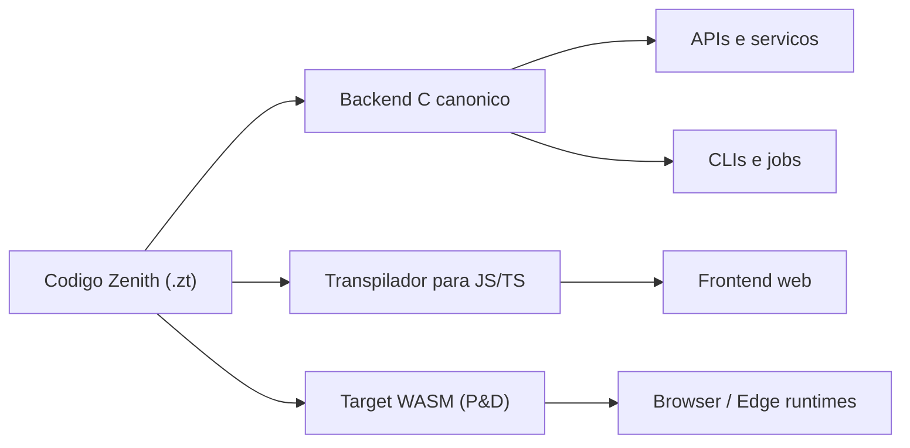
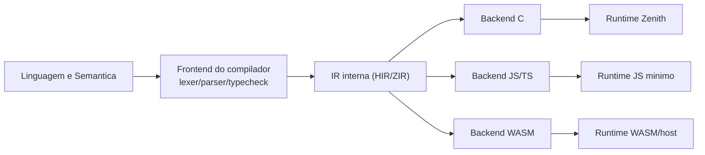
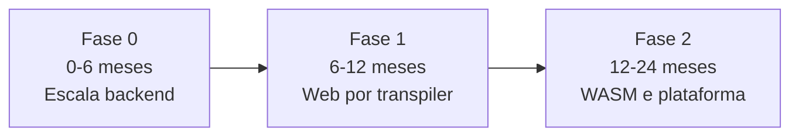

# Desenho Futuro da Zenith (TDAH-Friendly)

- Data: 2026-04-20
- Premissa: todos os itens do `IMPLEMENTATION_CHECKLIST.md` estao concluidos.
- Objetivo: mostrar, de forma simples, como sair de "linguagem pronta" para "produto robusto de mercado".

## Leitura Rapida (2 minutos)

1. Foque em **backend first** para gerar tracao real rapido.
2. Para web, use **Zenith -> JS (ESM)** como ponte pratica.
3. Trate **WASM** como trilha paralela de medio prazo (nao como bloqueio do produto).
4. Use **gates objetivos** por fase (performance, estabilidade, DX, seguranca).

---

## Mapa 1: Visao de Produto

Como ler:
1. O mesmo codigo Zenith alimenta 3 trilhas.
2. A trilha principal de negocio e backend.
3. Web entra com transpiler.
4. WASM entra depois, com escopo controlado.

---

## Mapa 2: Camadas Tecnicas

Ponto central:
1. Se a IR ficar bem definida e estavel, novos targets ficam muito mais baratos.
2. Sem IR forte, cada target vira retrabalho.

---

## Mapa 3: Ordem Recomendada (Roadmap Simples)

### Fase 0 (0-6 meses): Backend de verdade

Meta:
1. Rodar apps backend reais com previsibilidade.

Entregas:
1. Compilacao incremental + daemon.
2. Benchmarks oficiais com budget (CI bloqueando regressao).
3. Runtime hardening (memoria, erros, observabilidade).
4. `std.net`, `std.io`, `std.os`, `std.process` com testes pesados.
5. Mini framework HTTP estilo Sinatra (roteamento, middleware, erro padrao).

Gate para passar de fase:
1. P95 de latencia e throughput definidos e estaveis.
2. Zero regressao critica em nightly.
3. Projeto real de referencia em producao controlada.

---

### Fase 1 (6-12 meses): Web por transpiler JS/TS

Meta:
1. Permitir frontend sem o usuario escrever JS manualmente.

Entregas:
1. Emissor JS ESM.
2. Sourcemaps bons (debug Zenith no browser).
3. Geracao de `.d.ts` para interop com ecossistema TS.
4. Plugin Vite/Rollup para build/dev server.
5. Runtime JS pequeno e estavel.

Gate para passar de fase:
1. App web demo completo (SSR opcional, SPA obrigatorio).
2. Tempo de build e DX aceitaveis.
3. Stack traces mapeados para Zenith com boa clareza.

---

### Fase 2 (12-24 meses): WASM sem pressa e sem risco

Meta:
1. Validar onde WASM da vantagem real (perf, distribuicao, sandbox).

Entregas:
1. Prototipo Zenith -> WASM com subset bem definido.
2. Modelo de host ABI claro (I/O, tempo, rede, memoria).
3. Benchmark comparando C nativo vs JS transpile vs WASM.
4. Definicao de quando usar WASM (e quando nao usar).

Gate de maturidade:
1. Ganho medido em cenario real (nao apenas microbenchmark).
2. Ferramenta de debug minimamente utilizavel.
3. Custo de manutencao aceitavel para o time.

---

## Dificuldade (com e sem bibliotecas)

Escala:
- 1 = facil
- 3 = medio
- 5 = muito dificil

### 1) Mini framework backend (estilo Sinatra)

- Sem libs: **5/5**
- Com libs C (ex.: `libuv` + `llhttp` + `OpenSSL`): **3/5**

### 2) Transpilador Zenith -> JS/TS

- Sem libs de AST/source map: **5/5**
- Com libs (ex.: parser/AST infra + source maps + bundler plugins): **3/5**

### 3) Target WASM

- Sem toolchain madura: **5/5**
- Com toolchain existente (ex.: LLVM/Emscripten/WASI dependendo da estrategia): **4/5**

Resumo direto:
1. Bibliotecas reduzem muito o tempo.
2. Mesmo com bibliotecas, WASM segue mais caro que backend + transpiler JS.

---

## Gaps que ainda existem mesmo com checklist fechado

1. **Escala de projeto real**: e diferente de passar em suite de testes.
2. **Performance com SLO**: sem budget por metrica, regressao passa escondida.
3. **Observabilidade**: faltou tracing/metrics/log padrao em runtime e framework.
4. **Supply chain**: assinatura de pacote, auditoria e proveniencia forte.
5. **Governanca de evolucao**: RFC, LTS, deprecacao e compatibilidade por edition.
6. **DX web**: sourcemap, hot reload, mensagens de erro amigaveis.

---

## Gates de Mercado (Go/No-Go)

So considerar "pronta para mercado" quando os 5 gates abaixo estiverem verdes:

1. **Gate Tecnico**: estabilidade e performance em carga real.
2. **Gate Produto**: caso de uso real funcionando fim-a-fim.
3. **Gate DX**: onboarding rapido (CLI + docs + erros claros).
4. **Gate Ecossistema**: pacote, lockfile, audit e reproducao confiavel.
5. **Gate Operacional**: release train previsivel, rollback claro, politicas de suporte.

---

## Decisao Recomendada Hoje

Se o objetivo for crescer com menor risco:

1. Priorize **backend Zenith** agora.
2. Construa **transpilacao JS** como ponte para frontend.
3. Mantenha **WASM** em trilha de validacao tecnica e de negocio.

Essa sequencia maximiza tracao e reduz risco de sobrecarga tecnica no time.
