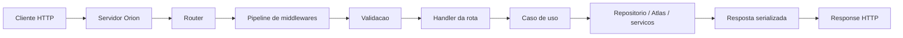
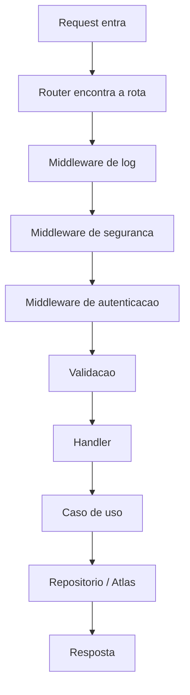

# Arquitetura do Framework Orion (TDAH-Friendly)

- Status: proposta de arquitetura v1
- Data: 2026-04-20
- Escopo: framework backend oficial do ecossistema Zenith
- Nome oficial: `Orion`

## Objetivo deste documento

Explicar, de forma clara, como o framework backend da Zenith deve ser desenhado.

Este documento nao assume experiencia previa com frameworks web.

Se voce nao sabe exatamente o que e `middleware`, `router`, `handler` ou `plugin`, tudo isso sera explicado aqui.

---

## Leitura Rapida

Se voce lembrar de apenas 5 coisas, lembre destas:

1. `Orion` deve ser simples por fora e forte por dentro.
2. A API publica deve ser facil de ler, estilo Sinatra.
3. O nucleo deve nascer pensando em seguranca, validacao e observabilidade.
4. Autenticacao, autorizacao e banco devem entrar como plugins oficiais, nao como peso fixo no core.
5. A organizacao da aplicacao deve seguir `Vertical Slice`, e nao `MVC` classico.

---

## 1. O que e o Orion

`Orion` e o framework backend da Zenith para:

1. APIs HTTP.
2. Servicos internos.
3. Webhooks.
4. Apps backend pequenos, medios e grandes.

Ele deve permitir que o usuario escreva algo simples como:

```zt
server.get("/users/:id", users.show)
```

Mas por baixo ele precisa ter estrutura suficiente para:

1. Validar entrada.
2. Tratar erro com previsibilidade.
3. Aplicar autenticacao e autorizacao.
4. Limitar abuso.
5. Integrar banco, cache, log e metricas.

Em uma frase:

`Orion` deve parecer pequeno, mas nao pode ser fragil.

---

## 2. Filosofia do framework

O Orion precisa respeitar a filosofia central da Zenith.

### 2.1 Reading-first

O codigo deve ser facil de ler antes de ser "esperto".

Isso significa:

1. Pouca magia.
2. Fluxo claro de request para response.
3. Nomes explicitos.
4. Erros tipados e compreensiveis.

### 2.2 Explicito sobre implicito

O framework nao deve esconder comportamento critico.

Exemplos:

1. Se a rota exige autenticacao, isso deve estar visivel.
2. Se existe validacao, ela deve estar declarada.
3. Se um plugin adiciona comportamento, isso deve ficar claro no bootstrap.

### 2.3 Seguro por padrao

Seguranca nao entra no final como remendo.

O Orion deve nascer com:

1. Limite de tamanho de body.
2. Parsing estrito.
3. Timeouts.
4. Tratamento central de erro.
5. Hooks claros para auth, rate limit e headers de seguranca.

### 2.4 Crescimento modular

O core deve ser pequeno.

Mas pequeno nao significa fraco.

Pequeno aqui significa:

1. O nucleo resolve o essencial muito bem.
2. Funcionalidades grandes entram como plugins oficiais.
3. O sistema cresce sem virar um monolito dificil de manter.

---

## 3. Desenho geral em uma imagem



Como ler o fluxo:

1. O cliente envia uma requisicao HTTP.
2. O Orion encontra a rota.
3. Os middlewares executam regras comuns.
4. A entrada e validada.
5. O handler chama a regra de negocio.
6. O resultado vira uma resposta HTTP previsivel.

---

## 4. O que e cada parte

Esta e a parte mais importante do documento.

### 4.1 Servidor HTTP

O servidor HTTP e a parte que:

1. Escuta uma porta.
2. Recebe conexoes.
3. Converte bytes da rede em uma requisicao HTTP.
4. Envia a resposta de volta.

Pense nele como a porta de entrada do predio.

Ele nao deveria conter regra de negocio.

---

### 4.2 Rota

Uma rota e uma regra do tipo:

- quando chegar `GET /users/10`
- execute tal codigo

Exemplos de rota:

1. `GET /health`
2. `POST /login`
3. `GET /users/:id`

A rota liga uma URL a uma acao da aplicacao.

---

### 4.3 Router

O `router` e a agenda que sabe:

1. quais rotas existem
2. qual metodo HTTP cada uma usa
3. qual handler chamar

Sem router, o servidor recebe requests, mas nao sabe para onde mandar cada uma.

---

### 4.4 Context

O `context` e o objeto que representa a requisicao atual.

Ele costuma carregar:

1. `params`
2. `query`
3. `headers`
4. `cookies`
5. `body`
6. `state`
7. informacoes do usuario autenticado

Exemplo mental:

Se a request foi `GET /users/42?page=2`, o `context` pode conter:

1. `params.id = "42"`
2. `query.page = "2"`

O `context` e a mochila da request.

Tudo que a request precisa carregar ao longo do caminho vai ali.

---

### 4.5 Middleware

`Middleware` e um dos termos que mais confunde no inicio.

Definicao simples:

`middleware` e um passo que roda no meio do caminho entre a entrada da request e o handler final.

Por isso o nome:

- `middle` = meio
- `ware` = camada/peca de software

Pense como uma esteira com checkpoints.

A request entra.

Antes de chegar na logica principal, ela passa por postos de controle.

Cada posto pode:

1. ler a request
2. alterar o `context`
3. bloquear a request
4. deixar a request seguir
5. registrar metricas ou logs

Exemplos de middleware:

1. log de requests
2. autenticacao JWT
3. rate limiting
4. CORS
5. tratamento de erro
6. medicao de tempo

Exemplo mental:

Se um predio tem portaria, detector e catraca:

1. a portaria verifica quem entrou
2. o detector verifica seguranca
3. a catraca controla acesso

Tudo isso acontece antes de voce chegar na sala final.

Isso e um pipeline de middlewares.

---

### 4.6 Handler

O `handler` e a funcao final da rota.

E a peca que responde algo como:

1. buscar usuario
2. criar pedido
3. validar login
4. devolver status da aplicacao

Ele deve ser enxuto.

Idealmente, o handler:

1. le dados do `context`
2. chama um caso de uso
3. devolve resposta

Ele nao deveria conter toda a regra de negocio do sistema.

---

### 4.7 Validacao

Validacao e a camada que confere se os dados recebidos fazem sentido.

Exemplos:

1. `email` tem formato valido?
2. `age` e numero?
3. `password` tem tamanho minimo?
4. `id` da URL realmente existe no formato esperado?

Sem validacao, o sistema aceita lixo e quebra depois.

Validar cedo deixa o sistema mais previsivel e mais seguro.

---

### 4.8 Plugin

Plugin e um modulo que adiciona capacidade ao framework sem inflar o core.

Exemplos:

1. plugin de JWT
2. plugin de sessao
3. plugin de PostgreSQL
4. plugin de metricas
5. plugin de OpenAPI

Um bom plugin deve:

1. ter contrato claro
2. integrar no `context` ou no pipeline
3. ser facil de ativar e desativar
4. nao quebrar o resto da aplicacao

---

### 4.9 Caso de uso

Caso de uso e a regra de negocio da feature.

Exemplos:

1. cadastrar usuario
2. aprovar pagamento
3. enviar email de recuperacao

Essa camada representa a intencao do sistema.

O handler conversa com o caso de uso.

O caso de uso conversa com repositorios, plugins ou servicos.

---

### 4.10 Repositorio

Repositorio e a camada que conversa com banco ou persistencia.

Ele sabe coisas como:

1. salvar usuario
2. buscar pedido
3. atualizar estoque

Ele nao deveria decidir regra de negocio.

Ele deveria apenas persistir e recuperar dados.

---

### 4.11 Serializacao

Serializar e transformar dados internos em algo que vai para fora.

Exemplo:

1. um valor interno da aplicacao vira JSON
2. um erro interno vira resposta HTTP `400` ou `404`

Essa etapa precisa ser consistente.

Se cada rota responder de um jeito completamente diferente, a API fica confusa.

---

## 5. O que pertence ao core

O `core` e o coracao do Orion.

Ele precisa ser pequeno, mas solido.

Itens que devem estar no core:

1. servidor HTTP
2. router
3. definicao de rotas
4. `context`
5. pipeline de middlewares
6. parsing de `params`, `query`, `headers`, `cookies` e `body`
7. validacao de entrada e saida
8. tratamento central de erro
9. helpers de resposta (`json`, `text`, `status`, `empty`)
10. limites seguros por padrao
11. hooks para autenticacao, autorizacao e observabilidade
12. bootstrap de plugins

Regra importante:

O core deve conhecer os pontos de extensao, mas nao precisa carregar todas as implementacoes concretas.

---

## 6. O que deve ser plugin oficial

Estas capacidades devem existir, mas nao precisam morar dentro do core:

1. `orion.auth.jwt`
2. `orion.auth.session`
3. `orion.security.cors`
4. `orion.security.csrf`
5. `orion.security.rate_limit`
6. `orion.security.secure_headers`
7. `orion.observe.tracing`
8. `orion.observe.metrics`
9. `atlas.pg`
10. `atlas.sqlite`
11. `orion.docs.openapi`
12. `orion.jobs`

Por que isso fica como plugin:

1. nem toda aplicacao precisa de tudo
2. reduz acoplamento
3. facilita evolucao independente
4. evita que o framework vire um bloco pesado e dificil de manter

---

## 7. O que fica no codigo da aplicacao

O framework nao deve tentar engolir a aplicacao.

Estas partes pertencem ao projeto do usuario:

1. regras de negocio
2. casos de uso
3. policies de permissao
4. schemas especificos da feature
5. repositorios da aplicacao
6. composicao de plugins
7. configuracao de rotas

Em resumo:

1. framework resolve infraestrutura
2. app resolve negocio

---

## 8. Seguranca: o framework deve nascer com isso em mente?

Sim.

Mas isso nao significa entupir o core com todas as features de seguranca.

A decisao correta e:

`secure by design, modular by default`

Isso significa:

1. o core deve ser desenhado para ser seguro
2. os mecanismos concretos devem entrar como plugins oficiais

### 8.1 O que tem que nascer no core

1. limites de body
2. timeouts
3. parser estrito
4. erro centralizado
5. API de cookies segura
6. hooks de auth
7. hooks de rate limit
8. hooks de logging e tracing

### 8.2 O que pode ser plugin

1. JWT
2. session cookie
3. CSRF
4. CORS
5. permissao por role
6. permissao por policy
7. rate limit concreto
8. cabecalhos de seguranca

---

## 9. Autenticacao e autorizacao

Esses dois termos parecem iguais, mas nao sao.

### 9.1 Autenticacao

Pergunta:

`quem e voce?`

Exemplos:

1. login e senha
2. token JWT
3. cookie de sessao
4. API key

### 9.2 Autorizacao

Pergunta:

`o que voce pode fazer?`

Exemplos:

1. usuario comum pode ver o proprio perfil
2. admin pode ver todos os usuarios
3. cliente nao pode acessar rota interna

### 9.3 Onde isso entra no Orion

Autenticacao e autorizacao nao devem ser hardcoded no core.

Mas o core precisa oferecer:

1. um jeito de plugins colocarem `current_user` no `context`
2. um jeito de plugins bloquearem acesso
3. um jeito previsivel de devolver `401` e `403`

---

## 10. Query: existem dois tipos

Quando se fala "query", normalmente duas coisas diferentes se misturam.

### 10.1 Query string HTTP

Exemplo:

`GET /users?page=2&search=ana`

Aqui, `page` e `search` sao dados da URL.

Isso deve estar no core.

Toda aplicacao web usa isso.

### 10.2 Query de banco

Exemplo:

`select * from users where active = true`

Isso nao deve estar no core do Orion.

Isso deve ficar em:

1. `Atlas`
2. adapters de banco
3. repositorios da aplicacao

Motivo:

Se o framework embute um ORM pesado cedo demais, ele engessa toda a arquitetura.

---

## 11. Por que eu recomendo nao usar MVC classico

`MVC` significa:

1. `Model`
2. `View`
3. `Controller`

Ele foi importante historicamente.

Mas para o Orion, eu nao recomendo usar MVC como estrutura principal.

### 11.1 Problemas comuns do MVC em backend moderno

1. controllers crescem demais
2. regras de negocio vazam para lugares errados
3. estrutura por camada fica longe da feature real
4. leitura piora em projetos grandes

### 11.2 Melhor alternativa: Vertical Slice

`Vertical Slice` organiza por feature.

Exemplo:

1. `users`
2. `billing`
3. `auth`

Cada feature guarda perto de si:

1. rotas
2. casos de uso
3. schemas
4. policies
5. repositorios

Isso combina melhor com a filosofia reading-first.

Voce abre a feature e encontra tudo que importa nela.

---

## 12. Estrutura recomendada da aplicacao

```text
app/
  main.zt
  bootstrap/
    server.zt
    plugins.zt
  features/
    users/
      routes.zt
      schemas.zt
      use_cases.zt
      policies.zt
      repo.zt
    auth/
      routes.zt
      schemas.zt
      use_cases.zt
      policies.zt
      repo.zt
  infra/
    http/
      middlewares.zt
      errors.zt
    db/
      pg.zt
    config/
      app_config.zt
```

Como ler essa estrutura:

1. `bootstrap/` monta o servidor
2. `features/` contem o negocio
3. `infra/` contem detalhes tecnicos compartilhados

---

## 13. Ciclo de vida de uma request



Explicacao passo a passo:

1. A request chega.
2. O Orion identifica qual rota deve responder.
3. Middlewares executam regras comuns.
4. A entrada e validada.
5. O handler chama a regra de negocio.
6. A regra de negocio consulta ou grava dados.
7. O resultado vira uma resposta padronizada.

---

## 14. Exemplo conceitual de uso

O exemplo abaixo e ilustrativo.

Ele mostra a ideia, nao uma API final congelada.

```zt
use orion
use orion.auth.jwt
use atlas.pg

func build_server() -> Server
    var server = orion.server()

    server.use(orion.middleware.request_log())
    server.use(orion.middleware.recover_errors())
    server.use(orion.security.secure_headers())
    server.use(orion.auth.jwt(optional = true))

    server.get("/health", health.show)
    server.get("/users/:id", users.show)
    server.post("/login", auth.login)

    return server
end
```

O que esse exemplo quer mostrar:

1. middlewares sao registrados uma vez
2. rotas ficam legiveis
3. plugins aparecem explicitamente
4. nada importante fica escondido

---

## 15. O que o core precisa saber, mas nao implementar por inteiro

Esta e uma ideia importante.

O core precisa conhecer certos conceitos para nao nascer torto.

Mesmo que a implementacao concreta venha depois.

Exemplos:

1. autenticacao
2. autorizacao
3. limite de taxa
4. tracing
5. metricas
6. banco
7. segredo/config sensivel

O core nao precisa trazer todas essas features prontas.

Mas ele precisa reservar os encaixes corretos para elas.

Se isso for ignorado no inicio, depois o framework cresce com remendos.

---

## 16. Integracoes naturais do ecossistema

O Orion nao deve existir sozinho.

Ele conversa bem com outros blocos do ecossistema:

1. `Atlas`: persistencia e acesso a dados
2. `Raz`: secrets, credenciais e configuracao sensivel
3. `Tempo`: benchmark, latencia e profiling
4. `Compass`: LSP e DX do desenvolvedor

Isso ajuda a manter coesao sem transformar o framework em um pacote gigante.

---

## 17. Decisao arquitetural principal

Se eu tivesse que resumir toda a recomendacao em uma unica frase:

`Orion deve ser Sinatra-like na experiencia, plugin-first na arquitetura e Vertical Slice na organizacao da aplicacao.`

Traduzindo:

1. simples para comecar
2. estruturado para crescer
3. legivel para manter

---

## 18. O que eu recomendo construir primeiro

Ordem recomendada para a v1:

1. servidor HTTP basico
2. router
3. `context`
4. pipeline de middlewares
5. helpers de response
6. validacao
7. tratamento de erro
8. plugins oficiais de seguranca
9. plugin de autenticacao JWT
10. integracao inicial com `Atlas`

Essa ordem reduz risco.

Voce constroi primeiro a espinha dorsal.

Depois adiciona capacidades sem deformar a base.

---

## 19. Erros que o Orion deve evitar

1. virar um framework enorme e confuso logo na v1
2. esconder comportamento critico por magia
3. colocar ORM pesado no core
4. usar MVC como dogma
5. deixar seguranca para depois
6. misturar regra de negocio com infraestrutura
7. criar plugins sem contratos claros

---

## 20. Resumo final

O Orion ideal para Zenith deve seguir este desenho:

1. `core` pequeno, seguro e previsivel
2. plugins oficiais para auth, seguranca, dados e observabilidade
3. app organizada por feature, nao por camada MVC
4. API publica simples para leitura
5. arquitetura interna preparada para escala real

Se isso for respeitado, o framework fica:

1. facil de aprender
2. facil de manter
3. seguro para crescer
4. coerente com a filosofia da Zenith
