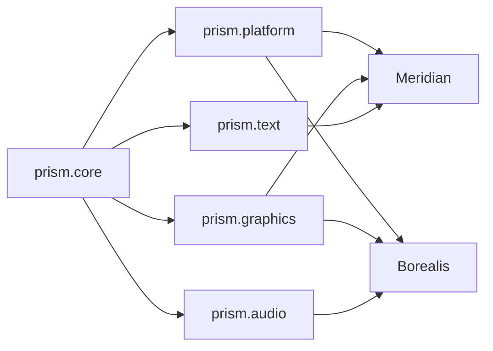

# Arquitetura Modular da Prism (TDAH-Friendly)

- Status: proposta de arquitetura
- Data: 2026-04-20
- Escopo: modularizacao da `Prism`

## Objetivo

Definir como a `Prism` deve ser separada para:

1. ser reutilizavel
2. evitar acoplamento desnecessario
3. servir bem `Meridian`, `Borealis` e outras ferramentas

## Resposta curta

Sim.

A `Prism` deve ser dividida.

Mas a divisao recomendada nao e em dezenas de pacotes pequenos.

O melhor equilibrio e:

1. `prism.platform`
2. `prism.graphics`
3. `prism.text`
4. `prism.audio`

E, por baixo, um nucleo pequeno:

- `prism.core` (interno ou semi-interno)

## Desenho geral



Como ler:

1. `core` e a base comum.
2. os 4 modulos publicos dependem apenas do `core`
3. `Meridian` usa `platform + graphics + text`
4. `Borealis` usa `platform + graphics + audio`

## Regra principal

Cada modulo deve ter:

1. responsabilidade clara
2. poucas dependencias
3. API publica pequena
4. zero conhecimento desnecessario dos outros modulos

Se um modulo comeca a conhecer detalhes internos do outro, a arquitetura perde valor.

## 1. prism.core

### O que e

E a base compartilhada da Prism.

Nao e o modulo "bonito".

E o modulo que evita duplicacao e padroniza contratos.

### O que entra aqui

1. tipos base (`Handle`, `Result`, `Span`, `Color`, `Vec2`, `Rect`)
2. erros comuns
3. alocacao e ownership helpers
4. wrappers de FFI
5. ids de recursos
6. logging basico
7. temporizacao simples
8. tipos de evento base

### O que nao entra aqui

1. janela
2. GPU
3. fontes
4. mixer de audio
5. widgets

### Regra

`prism.core` existe para suportar os outros modulos, nao para virar um modulo gigante.

## 2. prism.platform

### O que e

Camada que conversa com o sistema operacional.

### Responsabilidades

1. janelas
2. monitores
3. loop de eventos
4. teclado
5. mouse
6. gamepad
7. cursor
8. clipboard
9. timing do app
10. informacoes da plataforma

### O que ele entrega

1. `Window`
2. `Display`
3. `EventLoop`
4. `InputState`
5. `Clipboard`
6. `Timer`

### O que ele nao deve fazer

1. desenhar UI
2. fazer layout
3. renderizar texto
4. tocar audio

### Dependencias externas ideais

1. SDL3 para janela, eventos e input

### Quem usa mais

1. `Meridian`
2. `Borealis`
3. `Sentinel` em alguns cenarios

## 3. prism.graphics

### O que e

Camada de renderizacao visual.

E ela que desenha pixels, formas, imagens e composicao.

### Responsabilidades

1. surfaces
2. texturas
3. imagens
4. canvas 2D
5. draw lists
6. pipelines de render
7. composicao
8. shaders e materiais basicos
9. upload de recursos para GPU

### O que ele entrega

1. `Surface`
2. `Texture`
3. `Canvas`
4. `Renderer`
5. `RenderPass`
6. `Image`
7. `Brush`

### O que ele nao deve fazer

1. shaping de texto
2. layout de UI
3. automacao de janela
4. logica de audio

### Dependencias externas ideais

1. SDL3 GPU ou API nativa equivalente
2. Skia para rasterizacao 2D, se essa for a estrategia adotada

### Observacao importante

`graphics` deve saber desenhar glifos e atlas de texto.

Mas ele nao deve decidir como o texto foi quebrado, moldado ou medido.

Isso pertence ao `prism.text`.

## 4. prism.text

### O que e

Camada especializada em texto.

Texto nao e um detalhe de renderizacao.

Texto e um subsistema proprio.

### Responsabilidades

1. carregar fontes
2. fallback de fontes
3. shaping
4. medicao
5. line breaking
6. bidi
7. glyph runs
8. hit testing de texto
9. caret e selecao
10. layout de paragrafos

### O que ele entrega

1. `Font`
2. `FontFamily`
3. `TextBuffer`
4. `GlyphRun`
5. `ParagraphLayout`
6. `TextMetrics`
7. `TextHit`

### O que ele nao deve fazer

1. abrir janela
2. lidar com mouse global
3. fazer mixer de audio
4. definir widgets

### Dependencias externas ideais

1. HarfBuzz para shaping
2. Skia ou FreeType para rasterizacao/medicao, conforme a estrategia

### Regra importante

Nao misturar `text` dentro de `graphics`.

Isso parece simples no inicio, mas complica muito:

1. scripts complexos
2. emoji
3. fontes variaveis
4. selecao
5. edicao de texto

## 5. prism.audio

### O que e

Camada de som.

### Responsabilidades

1. dispositivos de reproducao
2. dispositivos de captura
3. streams
4. buffers
5. mixer
6. grupos de volume
7. playback de efeitos
8. playback de musica
9. gravacao basica
10. efeitos basicos

### O que ele entrega

1. `AudioDevice`
2. `AudioStream`
3. `Sound`
4. `Music`
5. `Mixer`
6. `AudioBuffer`

### O que ele nao deve fazer

1. input de teclado
2. UI
3. renderizacao
4. texto

### Dependencias externas ideais

1. miniaudio
2. SDL3 Audio em casos especificos

## 6. Por que 4 modulos e uma boa divisao

Porque essa divisao acompanha os problemas reais.

### Meridian

Precisa muito de:

1. `platform`
2. `graphics`
3. `text`

Precisa pouco ou nada de:

1. `audio`

### Borealis

Precisa muito de:

1. `platform`
2. `graphics`
3. `audio`

Precisa as vezes de:

1. `text`

### Ferramentas menores

Exemplos:

1. visualizador de imagens: `platform + graphics`
2. editor de texto: `platform + graphics + text`
3. player de audio: `platform + audio`

Ou seja:

A divisao gera reaproveitamento real.

## 7. O que eu evitaria

### Evitar monolito

Nao fazer:

- `prism` com tudo misturado

Problemas:

1. build mais pesado
2. testes piores
3. mais acoplamento
4. reuse ruim

### Evitar microfragmentacao cedo demais

Nao fazer agora:

1. `prism.window`
2. `prism.cursor`
3. `prism.monitor`
4. `prism.keyboard`
5. `prism.mouse`
6. `prism.shader`

Problema:

Vira arquitetura "bonita no papel", mas chata de manter.

## 8. Dependencias permitidas

Regra recomendada:

1. `prism.core` nao depende de nenhum modulo Prism publico
2. `prism.platform` depende de `prism.core`
3. `prism.graphics` depende de `prism.core`
4. `prism.text` depende de `prism.core`
5. `prism.audio` depende de `prism.core`

Dependencias que eu nao recomendo:

1. `prism.graphics -> prism.audio`
2. `prism.audio -> prism.text`
3. `prism.platform -> prism.graphics`
4. `prism.text -> prism.audio`

Se um caso especial exigir cooperacao, isso deve ser feito por integracao na camada superior, nao por dependencia circular.

## 9. API publica ideal

Cada modulo deve ter:

1. um ponto de entrada pequeno
2. nomes previsiveis
3. poucos conceitos obrigatorios

Exemplo mental:

```zt
use prism.platform
use prism.graphics
use prism.text

var app = platform.app()
var window = app.create_window("Zenith")
var renderer = graphics.create_renderer(window)
var font = text.load_font("Serif")
```

Isso nao e uma API final.

E apenas o tipo de ergonomia que vale buscar.

## 10. O que fica fora da Prism

Isso e importante.

A Prism nao deve virar tudo.

Nao devem morar nela:

1. widgets declarativos
2. layout reativo de UI
3. sistema de componentes
4. temas de alto nivel
5. MVVM
6. automacao de desktop
7. cena de jogo de alto nivel

Essas camadas pertencem a:

1. `Meridian`
2. `Sentinel`
3. `Borealis`
4. `Asterism`

## 11. Ordem recomendada de implementacao

### Fase 1

1. `prism.core`
2. `prism.platform`
3. `prism.graphics`

Motivo:

Sem isso, nada visual confiavel roda.

### Fase 2

1. `prism.text`

Motivo:

Sem texto bom, `Meridian` nasce capado.

### Fase 3

1. `prism.audio`

Motivo:

Importante para `Borealis`, mas nao bloqueia a trilha de UI.

## 12. Decisao final recomendada

Se o objetivo e ter uma base limpa, reutilizavel e escalavel:

1. dividir a `Prism` em 4 modulos publicos
2. manter um `core` pequeno por baixo
3. tratar texto como modulo proprio
4. evitar monolito e evitar micro-modulos cedo demais

## 13. Resumo em uma frase

`Prism` deve ser um guarda-chuva com 4 modulos autonomos e uma base compartilhada, nao um bloco unico nem uma sopa de pacotes pequenos.
