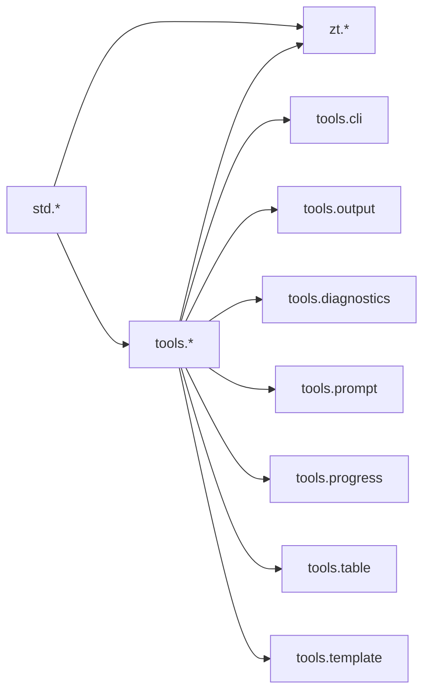

# Roadmap das Bibliotecas tools.* (TDAH-Friendly)

- Status: planejamento pos-MVP
- Data: 2026-04-20
- Escopo: bibliotecas oficiais para criacao de ferramentas, CLIs e automacoes
- Namespace: `tools.*`

## Objetivo

Criar uma camada oficial para ferramentas sem aumentar demais a `stdlib`.

A separacao recomendada e:

```text
std.*
base universal e enxuta

tools.*
bibliotecas oficiais para criar ferramentas

zt.*
ferramentas oficiais da linguagem
```

## Regra central

`std` deve ser pequeno, estavel e universal.

`tools` pode ser mais opinativo, porque serve para criar ferramentas boas.

`zt` usa `std` e `tools` para entregar comandos oficiais.

## Por que criar tools.*

Porque CLIs boas precisam de recursos que nao pertencem ao nucleo universal da linguagem.

Exemplos:

1. parser de flags
2. prompts interativos
3. tabelas bonitas
4. progresso
5. diagnosticos action-first
6. scaffolds
7. output humano e output JSON

Se tudo isso entrar em `std`, a stdlib cresce demais.

## Filosofia

As libs `tools.*` devem seguir a filosofia Zenith:

1. leitura primeiro
2. comportamento explicito
3. acessibilidade cognitiva
4. erro com proximo passo claro
5. saida boa para humanos e scripts
6. modularidade sem microfragmentacao

## Mapa dos namespaces



Como ler:

1. `tools` pode depender de `std`.
2. `zt` pode depender de `std` e `tools`.
3. `std` nao deve depender de `tools`.

## Modulos recomendados

## 1. tools.cli

Responsabilidade:

1. comandos
2. subcomandos
3. flags
4. argumentos posicionais
5. help automatico
6. validacao de entrada

Problemas que resolve:

1. evitar parser manual
2. padronizar help
3. reduzir erros em CLIs oficiais

Exemplo mental:

```zt
var app = cli.app("zt-doctor")
app.command("check", run_check)
app.flag("--json", "Emitir JSON")
```

## 2. tools.output

Responsabilidade:

1. saida humana
2. saida JSON
3. saida NDJSON
4. modo quiet
5. modo verbose
6. codigo de saida padronizado

Problemas que resolve:

1. ferramenta boa para pessoas
2. ferramenta boa para scripts
3. output previsivel em CI

## 3. tools.diagnostics

Responsabilidade:

1. mensagens action-first
2. spans de arquivo quando houver
3. severidade
4. sugestoes
5. codigos de erro
6. formato `ACTION / WHY / NEXT`

Problemas que resolve:

1. reduzir parede de texto
2. facilitar correcao
3. manter acessibilidade TDAH/dislexia

## 4. tools.prompt

Responsabilidade:

1. confirmacao
2. escolha unica
3. escolha multipla
4. input de texto
5. senha mascarada
6. fallback para modo nao interativo

Problemas que resolve:

1. scaffolds seguros
2. comandos guiados
3. automacoes que nao travam em CI

## 5. tools.progress

Responsabilidade:

1. etapas
2. progresso
3. spinner
4. logs agrupados
5. medicao de tempo
6. cancelamento futuro

Problemas que resolve:

1. comando longo nao parece travado
2. CI fica mais legivel
3. usuario entende onde falhou

## 6. tools.table

Responsabilidade:

1. tabelas alinhadas
2. truncamento
3. largura de terminal
4. modo compacto
5. export para markdown/JSON quando fizer sentido

Problemas que resolve:

1. listar pacotes
2. listar testes
3. mostrar diagnosticos resumidos
4. mostrar resultados de benchmark

## 7. tools.template

Responsabilidade:

1. renderizar templates de texto
2. gerar arquivos
3. scaffolds
4. placeholders seguros
5. erro claro para variavel ausente

Problemas que resolve:

1. `zt new`
2. geradores de projeto
3. templates de codigo
4. documentacao gerada

## O que fica fora de tools.*

Nao colocar em `tools`:

1. I/O basico
2. path basico
3. processo basico
4. JSON basico
5. tempo basico
6. HTTP basico

Essas coisas pertencem a `std`.

## Relacao com comandos zt.*

Os comandos oficiais devem validar as libs `tools`.

Exemplos:

1. `zt doctor` valida `tools.diagnostics`, `tools.output`, `tools.table`
2. `zt new` valida `tools.cli`, `tools.prompt`, `tools.template`
3. `zt bench` valida `tools.progress`, `tools.table`, `tools.output`
4. `zt test` valida `tools.diagnostics`, `tools.output`
5. `zt release` valida `tools.cli`, `tools.progress`, `tools.diagnostics`

## Fase P0: Fundacao de CLI

Objetivo:

Permitir criar CLIs nao interativas e boas para CI.

Entregas:

1. `tools.cli`
2. `tools.output`
3. nucleo de `tools.diagnostics`
4. exemplos pequenos
5. testes de comportamento

Gate:

Criar uma CLI com subcomando, flags, help, erro legivel e output JSON.

## Fase P1: Experiencia interativa

Objetivo:

Permitir ferramentas guiadas e scaffolds.

Entregas:

1. `tools.prompt`
2. `tools.progress`
3. `tools.table`
4. `tools.template`
5. modo nao interativo para CI

Gate:

Criar `zt new` ou ferramenta equivalente sem parser manual.

## Fase P2: Produto real

Objetivo:

Usar `tools.*` em comandos oficiais da linguagem.

Entregas:

1. `zt doctor`
2. `zt new`
3. `zt bench`
4. `zt explain`
5. `zt release`

Gate:

Pelo menos 3 comandos oficiais usando `tools.*` em fluxo real.

## Fase P3: Maturidade

Objetivo:

Transformar `tools.*` em pacote oficial estavel.

Entregas:

1. ZDoc completa
2. exemplos por modulo
3. testes de acessibilidade de output
4. snapshots de saida
5. politica de compatibilidade
6. versionamento semantico

Gate:

Mudancas quebrantes em `tools.*` exigem decision propria.

## Riscos

1. `tools` virar uma segunda stdlib gigante
2. `tools.cli` ficar magico demais
3. output humano quebrar scripts
4. prompts travarem CI
5. diagnosticos ficarem bonitos, mas pouco acionaveis

## Decisao recomendada

Criar `tools.*` como camada oficial pos-MVP para ferramentas.

Manter `std.*` enxuta.

Usar comandos `zt.*` como campo de prova real.
